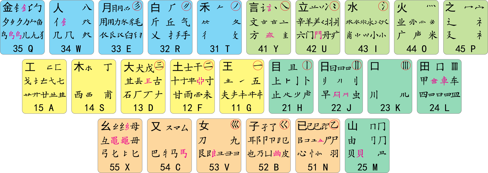

# 98五笔 Rime中州韵配置

这是Rime[小狼毫]输入法的98五笔配置文件，需要放置到`$env:APPDATA/Rime`目录下，
[小狼毫]自带的配置文件在`程序文件夹/data`，部署时，用户配置与自带配置合并，生成新的配置文件 `$env:APPDATA/Rime/build`，
所以有些用户配置文件名称有`custom`字样，就是以patch形式写书的。

此配置是从KyleBing的[86五笔极点码表]修改而来的。

Rime配置比较复杂，而且没有好的官方文档，很多细节就不再花时间深究了，
对自己来说，98五笔能用就足够了。


调整字词权重，直接编辑dict文件，再重新部署。

```
# 修改后，重新部署
.\deploy.ps1
```

## 使用

### 快捷键

* `ctrl+0` 输入法菜单
* `tab` 候选字词翻页
* `shift+tab` 候选字词反向翻页
* `;` `'` 二三候选

### 反查

* `z` 拼音反查五笔，例如：`zhaode` 查询 `好的` 。
* `` z` `` 笔画(hspnz)反查五笔，`hspnz`分别代表横竖撇捺折，另外`㇔`包含在`n`里面，例如：`` z`nhhsh `` 查询 `主` 字 

### 日期

* `date`  日期
* `time`  时间
* `week`  星期

这几个单词没怎么被五笔编码占用，正好可以利用它们来输入当前日期。

### 符号

|      |                  |
| ---- | ---------------- |
| /fh  | 一些常用符号     |
| /dw  | 单位，例如 `℃`   |
| /1   | 壹               |
| /2   | 貳               |
| /yy  | 音乐             |
| /tq  | 天气             |
| /xh  | 雪花             |
| /xl  | 小写希腊字母     |
| /xld | 大写希腊字母     |
| /a   | 衍生符号，例如 ǎ |
| /u   | 衍生符号，例如 ù |
| /py  | 拼音             |
| /sb  | 上标             |
| /xb  | 下标             |
| /sx  | 数学             |
| /hb  | 货币             |
| /jg  | 结构             |
| /pp  | 偏旁             |
| /bh  | 笔画             |

还有很多没有列出来，参见 `程序文件夹/data/symbols.yaml` 。

## 五笔

### 码元表



图片来自《[98五笔基础码表]》

### 拆字

汉字的全码大部分情况下都是四个字母，少部分字是三个字母，这样码元不够时要用笔画补齐，码元多出时要省略掉中间的一些码元。

有四个码元要按两下，称为补码码元：`礻py`、 `衤pu`、 `犭qt`、 `飠wv`，这样做当然是为了补够四码。

只有一个码元构成的字，也称为成字码元，码元作为首码，其余码用笔画拆出。
例如`文`拆解成yygy，分别对应码元、首笔、次笔、末笔。
另外一些码元也可以用这种方法输入，例如`巛`拆解成`vnnn`、`虍`拆解成`hhgn`，
当然其它的大部分码元都不是字，并不能输入。

笔画码元的输入方式是固定的，`一(横) ggll`，`丨(竖) hhll`，`丿(撇) ttll`，`丶(点/捺) yyll`，`乀(折) nnll`。

两个或三个码元构成的字，最后要加一个识别码，识别码就是码元表中的被圆圈标出的码。
例如`叭`拆解成`kwy`，末笔是捺，左右结构，识别码就是`y`。
上下结构对应`u`，混合结合对应`i`，例如`只`拆解成`kwu`。
其它笔画的识别码也用一样的方法添加。

四个码元构成的字，就对应四个字母。

码元多于四，取前三个码元和最后一个码元。


### 键面字

每个键位上的第一个成字码元，键位重复按四下，这是固定的，不使用拆字的思维。

| 字  | 码   |
| --- | ---- |
| 工  | aaaa |
| 子  | bbbb |
| 又  | cccc |
| 大  | dddd |
| 月  | eeee |
| 土  | ffff |
| 王  | gggg |
| 目  | hhhh |
| 水  | iiii |
| 日  | jjjj |
| 口  | kkkk |
| 田  | llll |
| 山  | mmmm |
| 已  | nnnn |
| 火  | oooo |
| 之  | pppp |
| 金  | qqqq |
| 白  | rrrr |
| 木  | ssss |
| 禾  | tttt |
| 立  | uuuu |
| 女  | vvvv |
| 人  | wwww |
| 幺  | xxxx |
| 言  | yyyy |

### 一级简码

一个键位对应一个字，也是固定的，不拆字。

但输入词汇时，不使用一级简码的编码，使用全码，因为简码不够两个字母，没法用在词组，例如：`我们 trwu`。

| 字  | 码  |
| --- | --- |
| 我  | q   |
| 人  | w   |
| 有  | e   |
| 的  | r   |
| 和  | t   |
| 主  | y   |
| 产  | u   |
| 不  | i   |
| 为  | o   |
| 这  | p   |
| 工  | a   |
| 要  | s   |
| 在  | d   |
| 地  | f   |
| 一  | g   |
| 上  | h   |
| 是  | j   |
| 中  | k   |
| 国  | l   |
| 经  | x   |
| 以  | c   |
| 发  | v   |
| 了  | b   |
| 民  | n   |
| 同  | m   |

### 二级简码

取全码的前两个码，生僻字不用简码，留给词用。
被赋二级简码的字集是固定的，约600百多个常用汉字，不依据[结巴中文分词]字频选择，因为这些字频不是百分百的准确。

```python
# g f d s a   h j k l m   t r e w q   y u i o p   n b v c x
('五于天末开' '下理事画现' '麦珀表珍万' '玉来求亚琛' '与击妻到互') # g
('十寺城某域' '直刊吉雷南' '才垢协零无' '坊增示赤过' '志坡雪支坶') # f
('三夺大厅左' '还百右面而' '故原历其克' '太辜砂矿达' '成破肆友龙') # d
('本票顶林模' '相查可柬贾' '枚析杉机构' '术样档杰枕' '札李根权楷') # s
('七革苦莆式' '牙划或苗贡' '攻区功共匹' '芳蒋东蘑芝' '艺节切芭药') # a 

('睛睦非盯瞒' '步旧占卤贞' '睡睥肯具餐' '虔瞳叔虚瞎' '虑〇眼眸此') # h
('量时晨果晓' '早昌蝇曙遇' '鉴蚯明蛤晚' '影暗晃显蛇' '电最归坚昆') # j
('号叶顺呆呀' '足虽吕喂员' '吃听另只兄' '唁咬吵嘛喧' '叫啊啸吧哟') # k
('车团因困轼' '四辊回田轴' '略斩男界罗' '罚较〇辘连' '思囝轨轻累') # l
('赋财央崧曲' '由则迥崭册' '败冈骨内见' '丹赠峭〇迪' '岂邮〇峻幽') # m

('年等知条长' '处得和备身' '秩稀务答稳' '入冬秒秋乏' '乐秀委么每') # t
('后质拓打找' '看提扣押抽' '手折拥兵换' '搞拉泉扩近' '所报扫反指') # r
('且肚须采肛' '毡胆加舆觅' '用貌朋办胸' '肪胶膛脏边' '力服妥肥脂') # e
('全什估休代' '个介保佃仙' '八风佣从你' '信们偿伙伫' '亿他分公化') # w
('钱针然钉氏' '外旬名甸负' '儿勿角欠多' '久匀尔炙锭' '包迎争色〇') # q

('证计诚订试' '让刘识亩市' '放义衣认询' '方详就亦亮' '记享良充率') # y
('半斗头亲并' '着间问闸端' '道交前闪次' '六立冰普〇' '闷疗妆痛北') # u
('光汗尖浦江' '小浊溃泗油' '少汽肖没沟' '济洋水渡党' '沁波当汉涨') # i
('精庄类床席' '业烛燥库灿' '庭粕粗府底' '广粒应炎迷' '断籽数序鹿') # o
('家守害宁赛' '寂审宫军宙' '客宾农空宛' '社实宵灾之' '官字安〇它') # p

('那导居懒异' '收慢避惭届' '改怕尾恰懈' '心习尿屡忱' '已敢恨怪尼') # n
('卫际承阿陈' '耻阳职阵出' '降孤阴队陶' '及联孙耿辽' '也子限取陛') # b
('建寻姑杂既' '肃旭如姻妯' '九婢姐妗婚' '妨嫌录灵退' '恳好妇妈姆') # v
('马对参牺戏' '〇〇台〇观' '矣〇能难物' '叉〇〇〇〇' '予邓艰双〇') # c
('线结顷缚红' '引旨强细贯' '乡绵组给约' '纺弱纱继综' '纪级绍弘比') # x
```

### 三级简码

取全码的前三个码，全码就是三码的优先占用，词频高的优先占用。
三级简码有可能会与全码重复，但这个不影响使用，主要是占住，不让其它字使用。

### 词

两个字：取每个字的前两个码，每个字的全码至少都是三个字母，取两个完全没问题。

三个字：取首字的首码，取次字的首码，再取三字的前两个码。

多个字：取首字的首码，取次字的首码，取三字的首码，再末字的首码。


## 词库

共收录27735个汉字，包含《[通用规范汉字表]》中的8105个汉字，能用到汉字可能也就六千个左右，
常用的三千来个，其余的大部分汉字你可能都没见过，更不会用到，不过这些汉字还是收录在字典了。

共收录约35万词汇，除常用词汇外，还收录了县级以上的地名，以及大量的自然科学相关的词汇。

字和词汇的初始权重是根据 [结巴中文分词] 的 suggest_freq 来确定的，后续可以根据需要进行调整，
dict文件都是按照五笔编码排序的，相同编码的词汇都在一起，调整的时候可以直接修改dict文件。

为了方便管理，所有的词都放到一个文件中，后续自己新添加的词也会放到这个文件。
另外，基础字的编码在一个文件，简码在一个文件。

```powershell
# 在Vim选择编码正文，用下面的powershell命令进行排序，
# 先按照五笔编码排序，再按照权重排序
!Group-Object { $_.Split()[1] } | Sort-Object { $_.Name } | ForEach-Object { $_.Group | Sort-Object { [int]$_.Split()[2] } -Descending }
```


## Rime Engine

Rime引擎的原理，原文链接[RimeWithSchemata]。

### Processors

输入引擎，作为整体来看，以按键消息为输入，输出包括三部分：

* 一是对按键消息的处理结果：操作系统要一个结果，这按键输入法接不接？
* 二是暂存于输入法，尚未完成处理的内容，会展现在输入法候选窗中。
* 三是要「上屏」的文字，并不是每按一键都有输出。

通常中文字都会伴随「确认」动作而上屏，有些按键则会直接导致符号上屏，而这些还要视具体场景而定。
那么第一类功能组件 processors，就是比较笼统地、起着「处理」按键消息的作用。

按键消息依次送往列表中的 processor，由他给出对按键的处理意见：

* 或曰「收」、即由 Rime 响应该按键；
* 或曰「拒」、回禀操作系统 Rime 不做响应、请对按键做默认处理；
* 或曰这个按键我不认得、请下一个 processor 继续看。

优先级依照 processors 列表顺序排定，接收按键者会针对按键消息做处理。

虽然看起来 processor 通过组合可以承担引擎的全部任务，但为了将逻辑继续细分、Rime 又为引擎设置了另外三类功能组件。
这些组件都可以访问引擎中的数据对象——输入上下文，并将各自所做处理的阶段成果存于其中。

processor 最常见的处理，便是将按键所产生的字符记入上下文中的「输入码」序列。 当「输入码」发生变更时，下一组组件 segmentors 开始一轮新的作业。


### Segmentors

Segment是段落的意思，segmentor意即分段器，
将用户连续输入的文字、数字、符号等不同内容按照需要，识别不同格式的输入码，将输入码分成若干段分而治之。
这通过数轮代码段划分操作完成。
每一轮操作中、一众 segmentors 分别给出起始于某一处、符合特定格式的代码段，识别到的最长代码段成为本轮划分的结果，
而给出这一划分的一个或多个 segmentor 组件则可为该代码段打上「类型标签」；
从这一新代码段的结束位置，开始下一轮划分，直到整个输入码序列划分完毕。

举例来说，【朙月拼音】中，输入码 2012nian\，划分为三个编码段：2012（贴number标签）、nian（贴abc标签）、\（贴punct标签）。

那些标签是初步划分后判定的类型，也可能有一个编码段贴多个标签的情况。下一个阶段中，translators 会把特定类型的编码段翻译为文字。


### Translators

顾名思义，translator 完成由编码到文字的翻译。但有几个要点：

* 一是翻译的对象是划分好的一个代码段。
* 二是某个 translator 组件往往只翻译具有特定标签的代码段。
* 三是翻译的结果可能有多条，每条结果成为一个展现给用户的候选项。
* 四是代码段可由几种 translator 分别翻译、翻译结果按一定规则合并成一列候选。
* 五是候选项所对应的编码未必是整个代码段。用拼音敲一个词组时，词组后面继续列出单字候选，即是此例。

双目如探针般进入内存查看，发现翻译的结果呈现这种形式：

```
input | tag    | translations
------+--------+-------------------------------------
2012  | number | [ "2012" ], [ "二〇一二" ]
nian  | abc    | [ "年", "念", "唸",... ], [ "nian" ]
\     | punct  | [ "、", "\" ]
```

输入串划分为多个代码段、每段代码又可具有多组翻译结果；取各代码段的首选结果连接起来，就是预备上屏的文字「2012年、」。

且将以上所示的数据称为「作文」。这是一篇未定稿（未搞定）的作文，输入法介面此时显示预备上屏的文字「2012年、」，
并列出最末一个代码段上的候选「、」及「\」以供选择。

有两款主力 translator 完成主要文字内容的翻译，其实现的方式很不一样：

* script_translator 也叫做 r10n_translator 修炼罗马字分析法，以「固定音节表」为算法的基础，识别输入码的音节构成，推敲排列组合、完成遣词造句。
* table_translator 修炼传承自上世纪的码表功夫，基于规则的动态码表，构成编码空间内一个开放的编码集合。

拼音、注音、方言拼音，皆是以固定音节表上的拼写排列组合的方式产生编码，故适用罗马字分析法。
仓颉、五笔字型这类则是传统的码表输入法。

如果以码表方式来写拼音输入方案，是怎样的效果呢？
虽然仍可完成输入，但无法完全实现支持简拼、模糊拼音、使用隔音符号的动态调频、智能语句等有用的特性。

反之，以罗马字方式使用码表输入法，则无法实现定长编码顶字上屏、按编码规则构词等功能。
在 Rime 各发行版预设输入方案中，有一款「速成」输入方案，即是以 script_translator 翻译仓颉码，实现全、简码混合的语句输入。

概括起来，这是两种构造新编码的方式：罗马字式输入方案以一组固定的基本音节码创造新的组合而构词，
而码表式输入方案则以一定码长为限创造新的编码映射而构词。


### Filters

Filter即过滤器。 上一步已经收集到各个代码段的翻译结果，当输入法需要在介面呈现一页候选项时，
就从最末一个代码段的结果集中挑选、直至取够方案中设定的页最大候选数。

每从结果集选出一条字词、会经过一组 filters 过滤。多个 filter 串行工作，最终产出的结果进入候选序列。

filter 可以：

* 改装正在处理的候选项，修改某些属性值：简化字、火星文、菊花文有无有？过时了！有 Rime，你对文字的想象力终于得救
* 消除当前候选项，比如检测到重复（由不同 translator 产生）的候选条目
* 插入新的候选项，比如根据已有条目插入关联的结果
* 修改已有的候选序列


## 感谢


[小狼毫]

[结巴中文分词]

[搜狐词库]

[深蓝词库转换]

[清华大学词库]

[86五笔极点码表]

[极点五笔码表集合]

[雾凇拼音]

[白霜拼音]

[Rime Input Method Engine]

[98五笔基础码表]

[结巴中文分词]

[通用规范汉字表]

[五笔打字教程]

[Schema.yaml 詳解]

[Schema.yaml 详解]

[Extending RIME with Lua scripts]

[librime-lua wiki]


<!--
外部链接
-->

[Extending RIME with Lua scripts]: https://github.com/hchunhui/librime-lua

[小狼毫]: https://github.com/rime/weasel

[结巴中文分词]: https://github.com/fxsjy/jieba

[搜狐词库]: https://pinyin.sogou.com/dict/

[深蓝词库转换]: https://github.com/studyzy/imewlconverter

[清华大学词库]: https://github.com/thunlp/THUOCL

[86五笔极点码表]: https://github.com/KyleBing/rime-wubi86-jidian

[极点五笔码表集合]: https://github.com/KyleBing/wubi-jidan-dict

[雾凇拼音]: https://github.com/iDvel/rime-ice

[白霜拼音]: https://github.com/gaboolic/rime-frost

[Rime Input Method Engine]: https://github.com/rime/librime

[98五笔基础码表]: https://github.com/yanhuacuo/98wubi-tables

[结巴中文分词]: https://github.com/fxsjy/jieba

[通用规范汉字表]: https://zh.wikisource.org/wiki/%E9%80%9A%E7%94%A8%E8%A7%84%E8%8C%83%E6%B1%89%E5%AD%97%E8%A1%A8

[五笔打字教程]: https://www.wb98.com/wbwz/98help.htm

[Schema.yaml 详解]: https://github.com/KyleBing/rime-wubi86-jidian/wiki/Schema.yaml-%E8%AF%A6%E8%A7%A3

[Schema.yaml 詳解]: https://github.com/LEOYoon-Tsaw/Rime_collections/blob/master/Rime_description.md

[RimeWithSchemata]: https://github.com/rime/home/wiki/RimeWithSchemata

[librime-lua wiki]: https://github.com/hchunhui/librime-lua/wiki